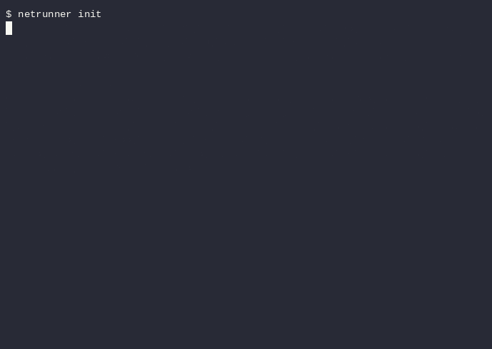

# Netrunner — Plug any project into any agent

**The universal jack.** Connect every project, every agent, one net.

[](LICENSE)
[](https://github.com/Christopher-Sch-dev/netrunner/releases)
[](https://github.com/Christopher-Sch-dev/netrunner/actions)
[](https://github.com/Christopher-Sch-dev/netrunner/actions)
[](https://github.com/Christopher-Sch-dev/netrunner)

> ⭐ **If Netrunner saves you time, give it a star** — it helps other agents find it.



Netrunner is an open-source, MIT-licensed **universal agent SDK**: a single binary that turns *any* project into something *any* AI agent can understand, operate, and control — with one command.

Inspired by the netrunners of Night City: the ones who jack into *any* system. Netrunner is that jack for your codebase.

---

## Why Netrunner

Today, making a project agent-operable means assembling a pile of moving parts: an MCP server here, a plugin there, a skill somewhere else, a graph index apart. That's **fragmentation as packaging, not engineering**. All those formats are just *views of the same contract*.

Netrunner is a **single motor** that is at the same time:

- **An AI SDK** — a clean programmatic contract for your tools.
- **An MCP server** — the universal transport (stdio + streamable HTTP).
- **An ACP agent** — the Agent Client Protocol for IDEs (Zed, Neovim, VS Code).
- **A skill** — procedural know-how for how the project is operated.
- **A plugin** — Agent Plugins 1.0 portable packaging.
- **A code knowledge graph** — context for the agent, so it never greps blind.
- **An agentic control plane** — deterministic operations, not blind commands.

One binary, all seven. No 500-tool menu: Netrunner exposes **only what's relevant** to the project and objective at hand (progressive disclosure).

---

## What it gives an agent

| Face | What the agent gets |
|---|---|
| **Understand** | Project dashboard, symbol map, call graph, blast radius — answers in a handful of calls, not grep/read storms |
| **Control** | Deterministic operations (test, build, lint) with exit codes and timeboxing |
| **Learn** | A self-generating skill that documents the project (git, versions, coverage, services, TODOs) |
| **Safely** | Read vs mutate separation, fail-closed policy, Black ICE secret guard |

---

## Quickstart

```bash
# Install — one command, cross-platform (Windows/macOS/Linux)

# macOS / Linux — downloads the prebuilt binary from GitHub Releases
curl -fsSL https://raw.githubusercontent.com/Christopher-Sch-dev/netrunner/main/install.sh | sh

# Windows (PowerShell) — downloads the prebuilt .exe from GitHub Releases
irm https://raw.githubusercontent.com/Christopher-Sch-dev/netrunner/main/install.ps1 | iex

# Or via npm (works on every platform)
npm i -g netrunner

# Or build from source (requires Bun)
git clone https://github.com/Christopher-Sch-dev/netrunner.git
cd netrunner
bun install
bun build --compile --outfile dist/netrunner src/cli.ts

# In any project
cd your-project
netrunner init        # index the project into a knowledge graph
netrunner status      # live snapshot: stack, git, versions, coverage, services, TODOs
netrunner install     # wire up your agents (MCP/ACP/plugin)
```

### Quick demo (real output)

```bash
$ netrunner status
{
  "_meta": { "schemaVersion": "1.0", "tool": "status" },
  "stack": { "language": "typescript", "framework": "node", "packageManager": "pnpm" },
  "git": { "branch": "develop", "remoteUrl": "https://github.com/Christopher-Sch-dev/netrunner.git" },
  "versions": { "prod": { "zod": "^4.4.3" }, "dev": { "vitest": "^3.0.0" } },
  "coverage": { "lines": 84.39, "functions": 89.74, "branches": 78.13, "statements": 84.39 },
  "services": { "services": [] },
  "todos": { "todos": [ { "file": "src/context/todos.ts", "line": 2, "tag": "TODO", "text": "..." } ] }
}
```

Every command returns **clean JSON** (agent-parseable, no hallucination) with standard exit codes and a `_meta` schema version.

---

## Commands

| Command | What it does |
|---|---|
| `netrunner` | Project dashboard (content-first) |
| `netrunner init [dir]` | Index the project into a knowledge graph + generate the connectable layer (mcp.json, SKILL.md, AGENTS.md, program.md) |
| `netrunner init <owner/repo>` | Jack a remote GitHub repo (clone + init) |
| `netrunner status [--docs]` | Live snapshot + regenerate README.generated.md / AGENTS.md (stack + git + versions + coverage + services + TODOs) |
| `netrunner map` | Export the graph as JSON (D3/mermaid visualizable) with provenance |
| `netrunner depth <sym> <level>` | Query a symbol by depth (L0 basic → L3 blast radius) |
| `netrunner explore <sym>` | Search symbols by name |
| `netrunner path <from> <to>` | Shortest-path between two symbols (BFS) |
| `netrunner god-nodes` | Most-connected nodes (architecture hubs) |
| `netrunner graph-report` | Human dashboard: god nodes + graph summary (markdown) |
| `netrunner plan "<goal>"` | Generate a plan from the indexed graph (real, symbol-aware) |
| `netrunner guard` | Black ICE: detect secrets, protected files, broken imports |
| `netrunner persist "<decision>"` | Save a durable decision with provenance |
| `netrunner rollback [create\|restore]` | Snapshot / restore project state (incl. decisions) |
| `netrunner policy <intent>` | Evaluate a permission (read/mutate) |
| `netrunner curate` | Deterministic self-improvement from observations |
| `netrunner lint` | Health-check the snapshot (stale, orphans) |
| `netrunner daemon [--watch]` | Daemon pass: sync + lint + curator + watchdog (resident with --watch) |
| `netrunner mesh <dirs...>` | Connect N projects into a multi-repo graph |
| `netrunner dump` | Print the full tool contract (auto-discovery) |
| `netrunner install <target>` | Wire up agents (mcp/opencode/claude/cursor/codex/gemini/hermes/dsh/fx/copilot/aider/devin/agents) |
| `netrunner uninstall <target>` | Revert the wiring |
| `netrunner plugin <name>` | Generate an Agent Plugin 1.0 package |
| `netrunner breach` | Decipher an unknown repo (stack → git → services → deck) |
| `netrunner deck` | Deck state: quickhacks + daemons + tools (progressive disclosure) |
| `netrunner mode <profile>` | Deck mode: explore / operate / audit (Wintermute/Neuromancer) |
| `netrunner quickhacks` | List quickhacks with cost/cooldown |
| `netrunner extract <url>` | Read a web: markdown + metadata + stack + links (local fetch, no deps) |
| `netrunner dna <url>` | Extract a web's design DNA: colors/typography/spacing/shape + DTCG tokens |
| `netrunner inspect <url>` | Inspect a web: console/network/perf/a11y (CDP DI or local fetch) |
| `netrunner setup` | Agentic one-command installer: detect SO/agents, configure opencode→hermes→claude→codex, verify |
| `netrunner resume` | Reload the deck state (snapshot + decisions + history + signals) |
| `netrunner sleeve [import <file>]` | Export/import the portable deck (Construct) |
| `netrunner doctor` | Self-check: lint + guard + canonStale |
| `netrunner history` | Operation history (the agent's memory) |
| `netrunner mcp-orchestrate` | Discover MCP servers, connect as client, aggregate tools into one contract |
| `netrunner ops <kind>` | Run a deterministic operation (test/build/lint) with exit code |
| `netrunner snapshot` | Snapshot the project state |
| `netrunner --mcp` | Serve as an MCP server over stdio (stateless 2026-07-28) |
| `netrunner --acp` | Serve as an ACP agent over stdio |
| `netrunner --a2a` | Serve as an A2A agent over stdio (Agent Card + SendMessage) |
| `netrunner --help` | List commands (or `<tool> --help` for a tool's schema) |

Global flags: `--dir <path>` (operate a specific project), `--human` (readable output).

---

## MCP: control the whole engine from 0 to 100

`netrunner --mcp` serves as an MCP server. Beyond the graph tools (exposed per-stack via progressive disclosure), it ships **meta-tools** that let an agent drive the entire engine without restarting:

| Meta-tool | What it does |
|---|---|
| `net_set_project <dir>` | Switch the project the server operates (navigate any repo without restarting) |
| `net_init <dir>` | Initialize a project (index graph + generate the connectable layer: SKILL.md/AGENTS.md/program.md/.mcp.json) |
| `net_run <command> [args]` | Run any CLI command as an MCP tool (allowlist of safe commands: status, guard, resume, extract, dna, inspect, plan, ...) |
| `net_available_toolsets` | List the toolsets available for the current project (derived from its stack) |
| `net_enable_toolset <toolset>` | Enable a toolset, dynamically registering its tools |

Every command is **independent and complete** — an agent can initialize a project, explore its graph, run operations, and inspect web pages all through MCP, with clean JSON output.

---

## Architecture

```
        MCP server · ACP agent · Agent Plugin · CLI/AXI   ← 4 views
                     │  (same ToolRegistry, no duplicated handlers)
        ┌────────────┴─────────────────────┐
        │   TOOLS CONTRACT (src/core)       │  ← single pure interface
        │   ToolRegistry · CapabilitySet    │
        └────────────┬─────────────────────┘
     context (graph) │ control (ops)  knowhow (skills)  storage(bun:sqlite)
        └────────────┴──────────────┴───────────────┘
     Connectors/seams: filesystem · subprocess · sandbox · git · telemetry
```

One `bun build --compile` → one binary `netrunner` that speaks all four formats by subcommand.

---

## Benchmarks

Netrunner's whole point is to redirect the agent's token budget from exploration to answers. Measured on this repo (3,053 lines of source):

| Approach | Tokens to understand the project |
|---|---|
| Read all source (grep/read storm) | 122,417 bytes |
| **Netrunner** (status + explore) | **7,239 bytes** |
| **Reduction** | **94.1% (16.9× fewer tokens)** |

Reproduce it: `python3 scripts/benchmark-tokens.py`.

---

## Try it on a real project

Netrunner was tested end-to-end with an AI agent (OpenCode + Nemotron) against three real projects, with **no context given** — the agent just ran `netrunner` and understood each project:

| Project | What the agent learned |
|---|---|
| **demo-hvac** | TypeScript + Astro + pnpm, branch `main`, 499 graph nodes |
| **demo-landing** | TypeScript + Astro + npm, branch `master`, 36 graph nodes |
| **demo-lead-qualifier** | TypeScript + Astro + pnpm, 1285 graph nodes |

---

## What's shipped

Everything below is implemented, tested (346 tests), and working:

- **Knowledge graph** — index any project into a symbol graph (explore/callers/callees/impact/path/god-nodes).
- **MCP server** (stateless 2026-07-28) + **ACP agent** + **A2A agent** + **CLI** + **plugin** views — one contract, four formats.
- **MCP orchestrator** — discover MCP servers, connect as client, aggregate their tools into one contract.
- **Self-generating skill** — documents the project (git, versions, coverage, services, TODOs).
- **Cyberpunk features** — persist/map/guard/depth/rollback/breach/deck/mode/quickhacks.
- **Policy + curator + validation gate** — deterministic self-improvement with external signal.
- **Daemon + watchdog + hooks** — resident sync/lint/curator, change detection, signals to the connected agent.
- **Multi-repo mesh** — connect N projects into one graph.
- **Web** — extract (markdown + stack + links), dna (design tokens + DTCG), inspect (console/network/perf/a11y).
- **Jack-remote** — connect a remote GitHub repo.
- **Progressive disclosure** — expose only what's relevant to the project and objective.
- **Net sleeve** — portable deck (export/import).
- **Setup** — agentic one-command installer (detect SO/agents, configure opencode→hermes→claude→codex).
- **Cross-platform** — Windows/macOS/Linux (build-matrix + install.sh + install.ps1).

**Graph languages:** TypeScript, TSX, JavaScript, Python, Go, Rust, Java, C#, PHP, Ruby.

---

## Contributing

We'd love your help. Netrunner is ambitious — a universal motor for the agent era — and every contribution moves it forward.

- **Report a bug** → [Open an issue](https://github.com/Christopher-Sch-dev/netrunner/issues)
- **Request a feature** → [Open a discussion](https://github.com/Christopher-Sch-dev/netrunner/discussions)
- **Contribute code** → see [CONTRIBUTING.md](CONTRIBUTING.md) (spec-first → Gherkin → TDD → mutation)

---

## Development

- **Stack**: TypeScript + Bun + pnpm · Target T0 (local, no servers).
- **Method**: spec-first → Gherkin → TDD → mutation testing → e2e.
- **Branches**: GitFlow (main → develop → feature/* / release/* / hotfix/*).
- **Read `AGENTS.md`** for how agents contribute to this repo.

## License

MIT. See [LICENSE](LICENSE).

---

*Netrunner — the universal jack. Built for the agent era.*
